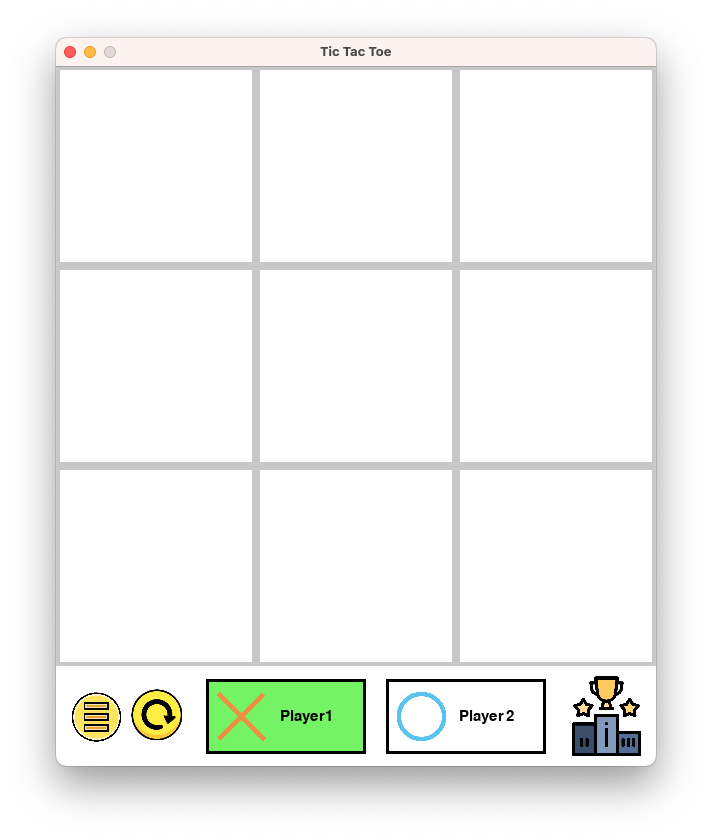

# TicTacToe

Implemented using python3, pygame, and flask.



## Getting Started

### Prerequisites
```
python3
```

### Installing
```
pip install -r requirements.txt
```

## Run Program
```
python api.py
python main.py
```

## Acknowlegements
[OOP Game Structure](https://github.com/kdbalabanov/tic-tac-toe-pygame)

[Flask Web Token Authentication](https://youtu.be/WxGBoY5iNXY)
